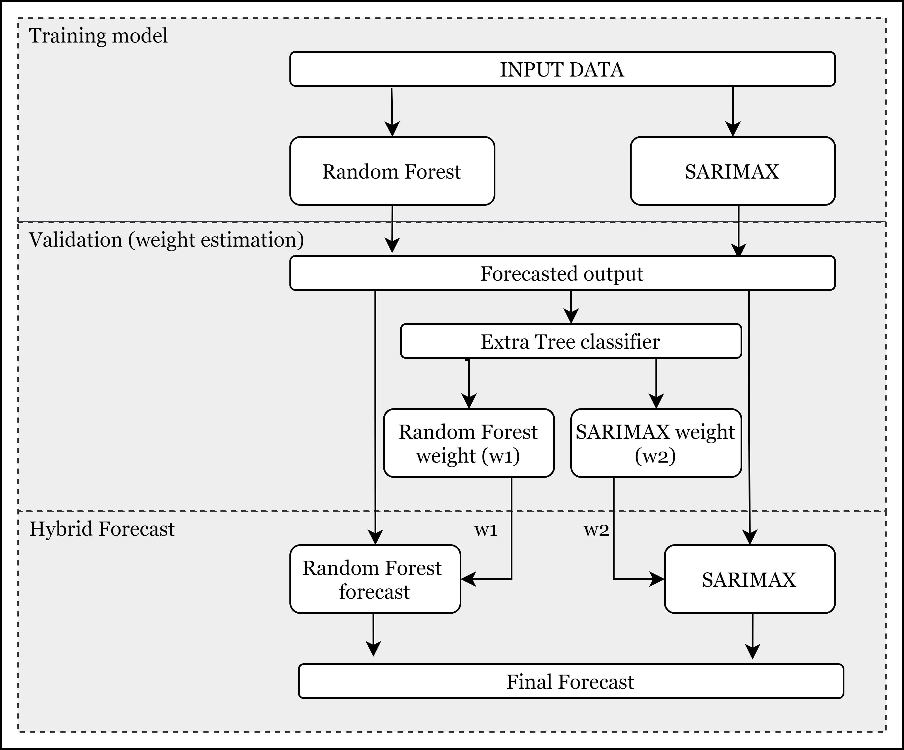
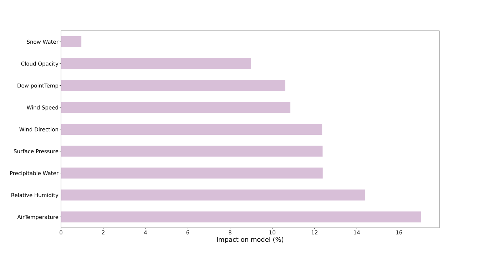
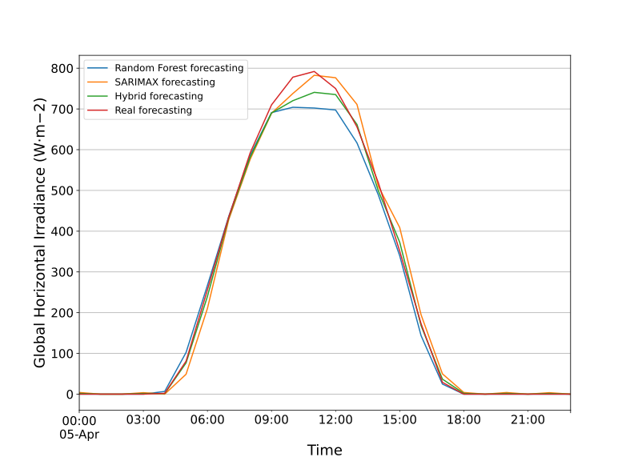

# Hybrid-forecasting-using-machine-learning-and-time-series
## Project description
This project is a model to combine the Machine learning model with the Time series model for hybrid forecasting of Global Horizontal Irradiance (GHI). This hybrid model exploits the performance of the Time series model and Machine learning model, which perform differently on a different set of weather conditions, to give a more accurate result. For this research, Random Forest has been used as a machine learning model, and for the Time series model, Seasonal Autoregressive Integrated Moving Average with exogenous regressors (SARIMAX) model has been used. The machine learning model considers weather conditions such as humidity, cloud cover temp, etc., to predict GHI, and the time series model only depends on past values of data which makes it independent of weather conditions.

## Model
### best_features.py
Use this model to find out impact of each features on model based on dataset. This uses Extra tree classifier algorithm.

### data_ext.py
This model is used to extract data from local.

### rf.py
This function is used for random forest forecasting. Forecasting date has to be intered as input and it automatically extract training data, validation data and test data. This function uses library 'RandomForestRegressor' from sklearn.ensemble. Function can be edited to select specific input features from dataset. Best way is to select features from  best_features.py which can give features which have more impact on model. By default all features have been selected.

### sarima.py
This function is used for time-series forecasting and uses SARIMAX model.Parameter for this model has to be estimated and optimised using ACF and PACF plot. 

### hybrid.py
Hybrid forecasting can be done using this function. This will automatically calculatesbresult from each model and combine them.

### forecasting.py
This program is for plotting results and calculating different errors for performance analysis.
## Authors

- [@hamzahshabbir](https://www.linkedin.com/in/hamzah-shabbir-108765a5/)

## Acknowledgements

 - [Solcast API](https://solcast.com/)
 - [Sci-kit learn](https://scikit-learn.org/stable/modules/generated/sklearn.ensemble.RandomForestRegressor.html)
 - [Statsmodel](https://www.statsmodels.org/stable/index.html)

  

## Feedback

If you have any feedback, please reach out to me at hamzahshabbir7@gmail.com

  
## 🔗 Links

## Screenshots

  
